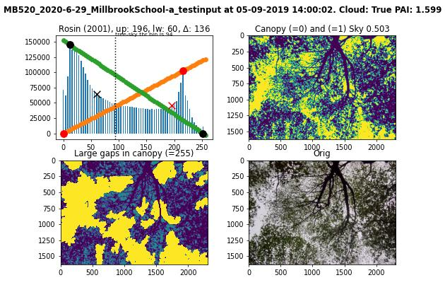

# EzPAI: Python scripts for extracting Plant Area Index from zenith-looking Digital Cover Photography

## Background and need: 
EzPAI was developed to meet our need to monitor tree canopy changes with Digital Cover Photography (DCP). DCPs were installed 40+ USDA soil moisture monitoring stations, that were installed to help with calibration and validation efforts of NASA’s Soil Moisture Active Passive (SMAP) over forests [1]. This particular SMAP Validation Experiment extended from 2019 through 2022, but only few stations had a continuous 4 year record (most had 3 years). Originally the experiment plan was to be conducted and completed during 2019, however a combination of COVID and SMAP satellite dropouts caused delays in the ability to conduct the field campaign until 2022.

## Rationale on making this tool:
DCP were used instead of digital hemispherical photography (DHP), due to the much greater cost of DHP. Our DCPs were wildlife cameras that only cost about $100 each [2]. Thus, we were able to install them at nearly every soil moisture station. Our DCPs were set to take output JPG imagery at high resolution (2304 x 1728 pixels) every hour. Thus, data volume could exceed 10k photos per camera. 
Although [3] already reported on how to extract PAI from for DCP back in 2012, there were no free tools to extract PAI/LAI from DCP until about 2022. In 2022, a tool for doing this kind processing was released recently for the R programming language [4], but it did not appear in our literature search ahead of developing EzPAI. Hence, we developed our own tool which like [4] is also based on [3]. 
EzPAI only uses the OpenCV library in addition to other relatively basic python libraries such as numpy, imageio, pandas, matplotlib and scikit-image. One goal was to use as few specialized libraries as possible. This was to allow others to check/modify the scripts to their needs more easily, and also to keep the overhead low for someone to transition EzPAI to other platforms such as a C# Windows application. Currently we have no plans to do this, due to time constraints. Although Python is slow, we were still able to process all our camera data within reasonable effort/time using EzPAI.

## Running this tool
1. first install my environment: conda env create -f paiproc.yml
2. python 0_hourscreen.py -i MB520_2020-6-29_MillbrookSchool-a_testinput
3. python 1_blurscreen.py -i MB520_2020-6-29_MillbrookSchool-a_testinput
4. python 2_getPAI.py -i MB520_2020-6-29_MillbrookSchool-a_testinput
, where -i is the folder containing the jpg images. The tool should also work with any other image format compatible with the imageio library (not tested).

The result of 4 is a csv file starting with '2_process' and some overview imagery prefixed with 'hist_', summarizing the important processing steps.
Beyond that, users will most likely need to postprocess data for QA/QC.

### Explanation:

**0_hourscreen.py**

Example: python 0_hourscreen.py -i MB520_2020-6-29_MillbrookSchool-a_testinput

This script to filter camera imagery by time of day, and export valid data to a file starting with '0_hourscreen_'. The time stamp is set by the -c option, by default it is set to obtain from exif (-c 2) but create time and modified time can also be used. This tool accomplishes two goals: (1) it allows users to skip images that don't fall inside the hours of the day they're interested in; (2) it writes the image date and time into a csv alongside the image name and allows it to be adjusted from there. However, in practice we did not need this kind of screening, as the blur screening script and postprocess filtering described later usually take care of them. However, it is still needed, because the .csv output is a required input to 1_blurscreen.py. For the 21 images in the example, it took 1.2 seconds (i7 Dell Precision 7560 Laptop).

csv content: the first column has the timestamp and the second column has the file name.

**1_blurscreen.py**

Example: python 1_blurscreen.py -i MB520_2020-6-29_MillbrookSchool-a_testinput

This script is a second filter, and screens the images listed in the '0_hourscreen_' file for blurry images. The output is written to a file starting with '1_blurscreen_'. Information and description of the default thresholds are provided in the script. The blur detection approach is based on the variance of Laplacian, i.e., if the variance (or max value) is lower than a threshold, the image is deemed blurry. For the 19 remaining images in 0_hourscreen csv it took 7.6 seconds (i7 Dell Precision 7560 Laptop).

csv content: same as 0_hourscreen, plus the variance (b1) and maximum value (b2) of the laplace filter result. The threshold is only used for screening out blurry imagery. Only non-blurry images are listed.

**2_getPAI.py**

Example: python 2_getPAI.py -i MB520_2020-6-29_MillbrookSchool-a_testinput

This script calculates all the items needed to obtain PAI, following the approach of Ryu et al. (2012). The output is given in a file starting with '2_getPAI_' . Information on the default settings are available in the script. These settings were used over all our images, to get the initial results for PAI and other plant structural parameters. For the 17 remaining images in 1_blurscreeen csv it took 13.1 seconds (i7 Dell Precision 7560 Laptop).

csv content:
- lmxb, lmxc and rmxb, rmxc are the locations and counts for the canopy (prefix l) and sky (prefix r) peaks.
- rb_l and rb_r are the locations of the bins used in the canopy/sky discrimination step, based on the Rosin method. 
- 'sky' gives the blue sky index mean value of the sky pixels. Here, sky pixels were determined using a manner than in the canopy sky partitioning (skythr = 0.75 vs tmthrc, tmthri values of 0.25 of 0.5). 
- minpixarea gives size of the smallest patches considered as large gaps as % of the image
- GF, CC, CP and PAI are the canopy structural parameters Gap Fraction, Crown Cover, Crown Porosity, Plant Area Index.
   
**hist_ image content:**

The upper left figure shows the image histogram. It also draws the line from the origin (last bin) to the rmxb (lmxb). These are used in the Rosin method to determine the bin location corresponding to the max curvature (i.e. longest perpendicular distance from the drawn lines). The Rosin bins rb_l (rb_r) are marked with the red (black) x, respectively. The figure also shows the canopy vs sky delineating bin, located between the Rosin bins, with a vertical dashed line and an annotation at the top of the figure. Here the sky is cloudy, and the delineating bin is at 0.25 the distance between the two Rosin bins. 

The upper right figure shows the result of partitioning the image into canopy and sky pixels. This paritioning is based on the rb_l and rb_r values, and can also be modified by the tmthri, tmthrc values explained below.

The lower right figure shows the input image for reference, after the camera metadata pixels had been removed from the bottom.

The lower left figure shows the large gaps that were identified in the image. It is important to keep in mind that this functionality is based on a simple contour finding approach, and the contours will often be larger in size than one would expect from visual inspection of the upper and lower right figures. This will bias results for canopy structural parameters, but results can still be expected to have reasonable magnitudes and consistency over time.

**0_run_ctrl.py**

Example: python 0_run_ctrl.py -i . -p MB

A convenience script for running the first three scripts in sequence using default values for each script, for each folder having a prefix (i.e., starting with the string) given by -p. Also, outputs duration of each step. 

- There could be some value in skipping the blur detection, as it adds almost 50% processing time. This may not be needed, given that blurry imagery may also be filtered out in other pre- or post- processing steps, getPAI can be changed to read in imagery from the hourscreen step output. 
- There can also be value in skipping hour screening, however given that it is fast and provides users with a csv of timestamps it not worth skipping. But one may want to modify the code to remove any screening and consider all available imagery, to avoid omitting useful data when the timestamps are wrong. Timestamps can be updated on the .csv as needed.
- It is recommended to update Timestamps ahead of the getPAI step, because timestamps are written out on the small overview images that summarize the PAI extraction process ('hist_' jpg), which can be useful for understanding or tweaking settings.

### Important parameters:
**cloudythr:** the threshold for the blue sky index value [3] that deciding if the image is mainly diffuse light (cloud, <thr) or not (clear, > thr). This is somewhat qualitative, and depends on the camera used and judgement. It should not take much time to obtain a reasonable estimate from trial and error. This parameter is quite important, because the threshold can impacts how image pixels are categorized into canopy and sky if tmthri and tmthrc have different values as our default code does. Cloudy vs not-cloudy is important for postprocessing, because ideally one would want to calibrate all imagery to diffuse light condition. 

**k**, the extinction coefficient in Beer's Law [3]: This is somewhat flexible and different, valid rationale can be made to set this value. Probably it would usually be in the 0.4-1.0 range. In our case, we did not have leaf angle distribution measurement, so we just assumed the G function that Ryu used for their 2012 paper over broadleaf forest, 'erectophile'. Our camera field of view was estimated at 40 degrees. We calculated k=G(40)/cos(40) and obtained k=0.65. Other manuscripts have used k = 0.5 for conifers or 0.6 for broadleaves or derived their k value using somewhat different logic. Probably not worth it to overthink how to exactly set k as long as it is within a reasonable range.

**skipbotpix**: DCP usually have some part of the image dedicated to metadata. In our imagery, this was put at the bottom of the image, so this setting removed the bottom pixels. Feel free to change the code to remove from image however needed, or do the cropping in a prior step.

**fcval**: the threshold for findcontours to identify large gaps between crowns [3]. For our image processing, we qualitatively determined that 10000 yielded reasonable results in our dense forest. We only added a way to determine what the smallest gap sizes were as percentage of the image, and it was about 0.3% for this setting. We also checked a few other values for our imagery, with 50k and 100k corresponding to about 1.4% and 3%, respectively. This is for our image size of were 2304 x (1728-skipbotpix), for imagery with larger (fewer) pixels than ours fcval needs to be increased (decreased) to keep the size as percentage of the image the same.

## Suggested postprocessing

First, one may want to re-screen data for QA/QC. We found the following to be helpful in screening poorly processed data:
- remove images having rb_r < 50 ; Rosin bin for maximum curvature for 'canopy' should be greater than some bin, from our data picked 50. For canopy, rb_r < 50 can correspond to a local min, followed by another smaller vegetation peak. EzPAI limitation is that it use a very basic peak finding, which is workable for but can be improved. Otherwise sky can be overestimated.
- remove images having rb_l < 128 ; Rosin bin for maximum curvature for 'sky' shouldn't be less than some bin, from our data picked 128. Otherwise sky can be overestimated.
- remove images having delta <= 18 ; if rb_r and rb_l are too close, can't accurately discriminate canopy from sky. Otherwise sky can be overestimated.
- remove images having CP < 0.02 ; very small CP values can give unreliable estimates. Probably CP of 0.15 could also be ok. This is because PAI values greatly with small CP, and small CP values can be due to DCP image, EzPAI limitations. Otherwise PAI change between hourly obs can be unrealiable, jump.
- remove images having 'sky' > 0.8 ; it is possible for summer canopy have strong blue tint throughout image, even if rb_r, rb_l, delta are in range. Else sky can be overestimated.

Second, after data had been screened one should consider calibrating all data to 'diffuse' light conditions:
- for each station do a linear regression between cloudy (blue sky index < cloudythr) and clear images. The pearson correlation coefficient R is usually > 0.8.
- use the regression relation to adjust the clear results for CC and CF to that of cloudy 
- recalculate CP and PAI

Some background on the need for calibrating to 'diffuse' light condition:
We noted a bias in CC/GF/PAI values depending on whether the sky is cloudy or not. This bias is expected a priori and is attributable to illumination differences [3]. Reference [3] addressed this by changing thresholds for canopy/sky discrimination depending on whether the sky was cloudy or not. Our getPAI script also has this functionality, but we used different threshold values that were more appropriate for our setup than those provided in [3] (see our tmthri, tmthrc values in the getPAI script). But even then, we still observed differences ('jumps') for same-day CC/CP/PAI values that depended on whether the sky was cloudy or not. We found that the above data screenings and calibration greatly improved consistency of the data, without eliminating all that much data. Obtaining 'calibrated PAI' from the csv outputs was a much better option, given the large amount of time and uncertainty involved in experimenting with different EzPAI settings and re-running the scripts each time.

## Preliminary results and future work:
Full analysis/write-up regarding the PAI extraction using this tool is still in progress. But we already compared our calibrated EzPAI results (i.e., the average of the 2019-2022 average summer PAI values at each station) to where LICOR-2200 in situ data were collected over 200 m x 200 m areas near the cameras during spring and summer 2022 (N=20) (see [5]). Results of this comparison show R = 0.89, RMSD = 0.93, MD = -0.54, and ubRMSD = 0.75, indicating good correspondence between EzPAI results and in situ. Other preliminary results also showed that postprocessed PAI results are temporally stable having within- and between-year variations of PAI (i.e., sdPAI/PAI) of < 5% at most stations. We're currently working on estimating LAI from our PAI values, and then plan also a more detailed comparison between our dense time LAI series to those obtained from remote sensing in a second future manuscript.

## References:

[1] Colliander, A., Cosh, M. H., Kelly, V. R., Kraatz, S., Bourgeau-Chavez, L., Siqueira, P., ... & Yueh, S. H. (2020). SMAP detects soil moisture under temperate forest canopies. Geophysical research letters, 47(19), e2020GL089697.

[2] Moultrie WCT-00125 TimelapseCam. We are not 100% sure about the field of view on WCT-00125, it was not in the manual. The manual for WCT-00126 gives FOV as 40 degrees, which sounds about right for WCT-00125 also.

[3] Ryu, Y., Verfaillie, J., Macfarlane, C., Kobayashi, H., Sonnentag, O., Vargas, R., ... & Baldocchi, D. D. (2012). Continuous observation of tree leaf area index at ecosystem scale using upward-pointing digital cameras. Remote Sensing of Environment, 126, 116-125.

[4] Chianucci, F., Ferrara, C., & Puletti, N. (2022). coveR: an R package for processing digital cover photography images to retrieve forest canopy attributes. Trees, 36(6), 1933-1942.

[5] Cook, C. L. , Bourgeau-Chavez, L., Miller, M. E., Vander Bilt, D., Kraatz, S., Cosh, M.H., Colliander, A. 2024. Comparison of In Situ and Remotely Sensed Leaf Area Index of Northeastern American Deciduous, Mixed, and Coniferous Forests for SMAPVEX19-22. *In Review*.

